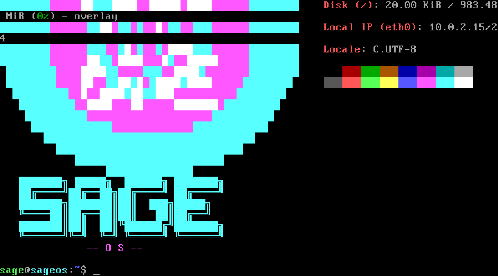
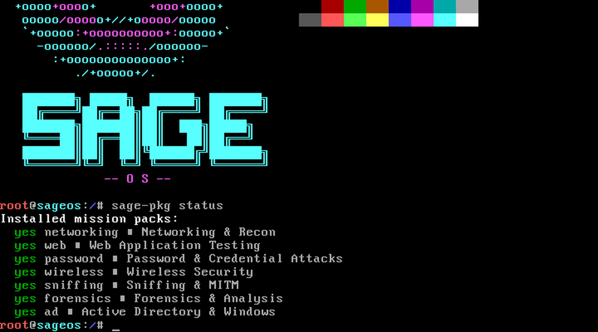
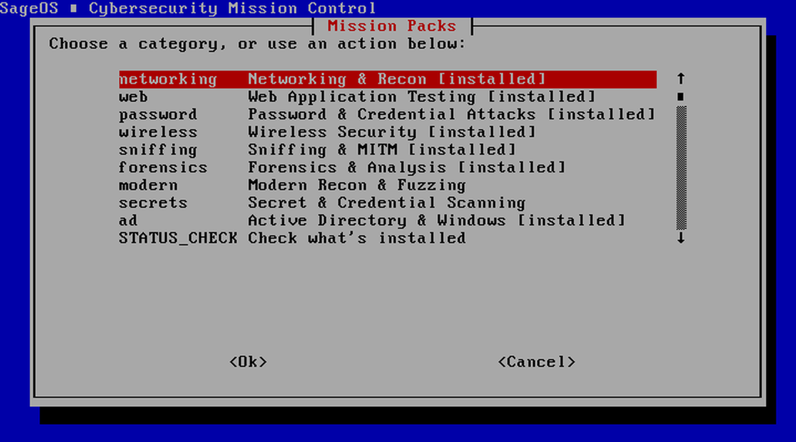
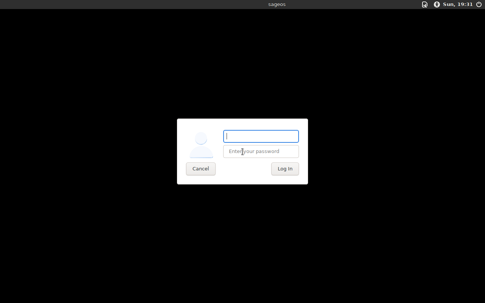

# SageOS

**A lightweight, security-focused Linux distribution with modular "mission pack" tooling.**

SageOS is a Debian bookworm-based live distro built for penetration testing and security work — without the bloat. Instead of shipping thousands of tools you'll never touch, SageOS ships a minimal, fast base system (OpenRC init, no systemd) and lets you install curated tool categories ("mission packs") on demand with `sage-pkg`, or through the friendly `sage-security` menu.



---

## Features

- **Live-boot ISO** — boots on real BIOS (ISOLINUX) and real UEFI (GRUB) hardware/VMs, no kernel-bypass tricks
- **OpenRC init** — dependency-based service management, no systemd overhead
- **Mission packs** — install only the tool categories you need, straight from Debian's official repos (plus curated GitHub/pip tools where Debian doesn't have them)
- **`sage-pkg`** — a simple CLI wrapper that installs mission packs from apt, GitHub releases, or pip as needed
- **`sage-security`** — a whiptail-based menu for browsing and installing packs visually, no CLI required
- **Optional desktop** — `sage-pkg install xfce` adds a full XFCE + lightdm graphical desktop on top of the lean base, or grab the XFCE-preinstalled ISO edition
- **Persistence** — `sage-persistence-setup` configures an overlayfs persistent volume on a second disk/USB partition
- **Custom branding** — SageOS splash on login via `fastfetch`
- **Small footprint** — curated tools only; extend via `sage-pkg`, not a kitchen-sink image

## Screenshots

| Boot splash (new logo) | Mission pack status | Security menu | XFCE desktop mission pack |
|---|---|---|---|
|  |  |  |  |

## Mission Packs

| Category | Tools | Purpose |
|---|---|---|
| **networking** | nmap, masscan, arp-scan, netcat-openbsd, tcpdump, whois, dnsutils, traceroute, mtr-tiny | Network discovery & recon |
| **web** | sqlmap, whatweb, dirb, gobuster, wfuzz, sslscan, wafw00f, fierce, wapiti | Web app testing |
| **password** | john, hydra, crunch, hashcat | Password auditing & cracking |
| **wireless** | aircrack-ng, macchanger, reaver | Wireless security testing |
| **sniffing** | tshark, ettercap-text-only, dsniff, bettercap | Traffic analysis & MITM |
| **forensics** | binwalk, foremost, libimage-exiftool-perl, sleuthkit, testdisk, volatility3 | Digital forensics |
| **modern** | nuclei, httpx, subfinder, naabu, ffuf, feroxbuster, rustscan | Fast Go/Rust recon & fuzzing tools |
| **secrets** | gitleaks, trufflehog | Find leaked keys/secrets in code & repos |
| **ad** | netexec, secretsdump.py, GetUserSPNs.py, psexec.py, wmiexec.py, evil-winrm | Active Directory / Windows attacks (pre-installed by default) |
| **windows** | smbmap, polenum, ldap-utils, samba-common-bin, nbtscan | Windows/SMB enumeration from Linux |
| **osint** | recon-ng, amass, sherlock | OSINT & recon on people/domains/infra |
| **opsec** | tor, torsocks, proxychains4, bleachbit, secure-delete, wipe, mat2, age | Anonymity, secret handling, evidence cleanup |
| **malware** | yara, clamav, upx, capa | Malware detection & static analysis |
| **reveng** | radare2, gdb, gdb-multiarch, ltrace, strace, ropper, pwntools | Reverse engineering & exploit dev |
| **xfce** | xfce4, xorg, lightdm | Optional graphical desktop environment |

Only **ad** ships pre-installed on the lean base ISO — every other pack is a `sage-pkg install <category>` away. Packages are pulled directly from official Debian bookworm repos where possible; a few modern tools (nuclei, gitleaks, amass, radare2, etc.) are fetched straight from upstream GitHub releases or pip since Debian doesn't package them.

## Getting Started

### Download (v5.3)

Two ISO editions:

- **`sageos-5.3.iso`** — the standard lean base. XFCE is available on-demand via `sage-pkg install xfce`.
- **`sageos-5.3-xfce.iso`** — same base, with XFCE + lightdm **pre-installed and enabled**. Boots straight to a graphical desktop login.

- **Direct download:** [Releases](../../releases/latest)
- **Torrents:** [sageos-5.3.iso.torrent](https://github.com/zackmsa777-a11y/sageos/releases/download/v5.3/sageos-5.3.iso.torrent) / [sageos-5.3-xfce.iso.torrent](https://github.com/zackmsa777-a11y/sageos/releases/download/v5.3/sageos-5.3-xfce.iso.torrent) — both include a GitHub HTTP webseed, so they download even with zero peers
- **Magnet links:** see the [v5.3 release notes](../../releases/tag/v5.3)
- **Full source:** every release includes a `-full-source.zip` asset with the live-boot init script, boot configs, custom tooling, and a `MANIFEST.md` — everything needed to understand or rebuild the distro

Default login: `sage` / `sageos` (or `root` / `sageos`).

### Boot it

**QEMU:**
```bash
qemu-system-x86_64 -m 2048 -cdrom sageos-5.3.iso -boot d
```

**VirtualBox / real hardware:** write the ISO to a USB drive or attach it as a virtual CD — it boots via both legacy BIOS and UEFI. Only x86_64 is supported.

### Install a mission pack

```bash
sage-pkg list                 # see all available categories
sage-pkg install networking   # install a category
sage-pkg status                # see what's installed
```

Or launch the visual menu:

```bash
sage-security
```

### Set up persistence

```bash
sage-persistence-setup
```

Formats a second disk/partition as an overlayfs upper layer so changes survive a reboot.

## Philosophy

Most security distros try to ship every tool that ever existed. SageOS takes the opposite approach: a small, fast, reliable core — and mission packs you install only when you need them. Less bloat, faster boots, and a system you actually understand.

## Building from Source

SageOS is built via `debootstrap` + `chroot` on a Debian bookworm rootfs, packaged into a hybrid BIOS/UEFI ISO with `xorriso`. Build scripts, package definitions, boot configs, and the live-boot `initramfs/init` script all live in this repo — see each release's `-full-source.zip` for the exact snapshot used to build that ISO, plus a `MANIFEST.md` explaining the full boot flow (BIOS/UEFI → initramfs → squashfs+overlay → switch_root → OpenRC → login).

## License

Built on Debian and open-source packages, each under their own respective licenses.
