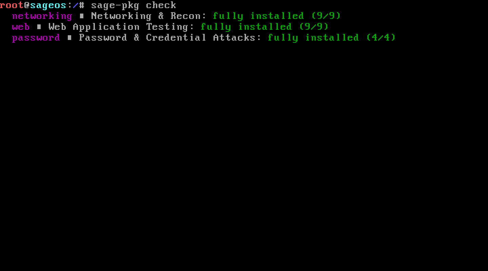
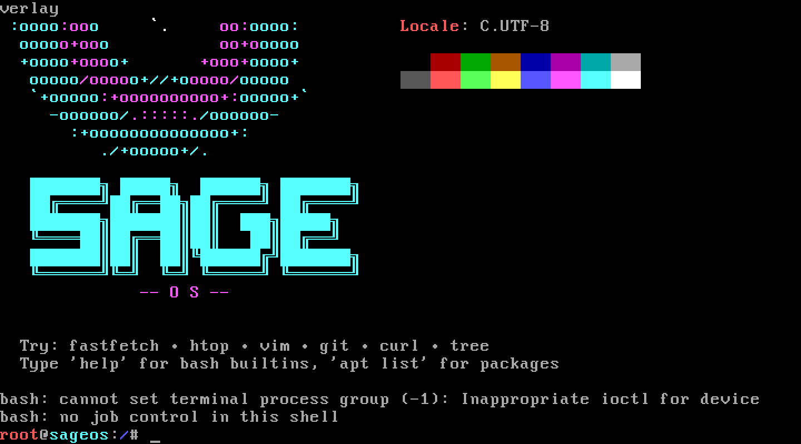
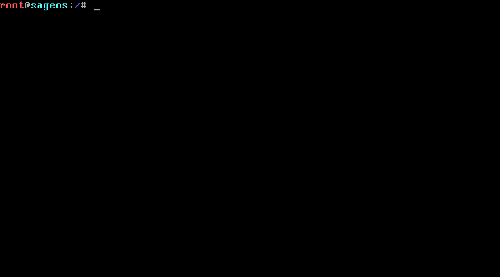

# SageOS

**A lightweight, security-focused Linux distribution with modular "mission pack" tooling.**

SageOS is a Debian bookworm-based live distro built for penetration testing and security work — without the bloat. Instead of shipping thousands of tools you'll never touch, SageOS ships a minimal, fast base system and lets you install curated tool categories ("mission packs") on demand with `sage-pkg`, or through the friendly `sage-security` menu.



---

## Features

- **Live-boot ISO** — boots on real BIOS (ISOLINUX) and real UEFI (GRUB) hardware/VMs, no kernel-bypass tricks
- **Mission packs** — install only the tool categories you need, straight from Debian's official repos
- **`sage-pkg`** — a simple CLI wrapper around `apt` for managing mission packs
- **`sage-security`** — a whiptail-based menu for browsing and installing packs visually, no CLI required
- **Custom branding** — SageOS splash on boot via `fastfetch`
- **Small footprint** — curated tools only; extend via `sage-pkg`, not a kitchen-sink image

## Screenshots

| Boot splash | Mission pack status | Security menu |
|---|---|---|
|  |  |  |

## Mission Packs

| Category | Tools | Purpose |
|---|---|---|
| **networking** | nmap, masscan, arp-scan, netcat-openbsd, tcpdump, whois, dnsutils, traceroute, mtr-tiny | Network discovery & recon |
| **web** | sqlmap, whatweb, dirb, gobuster, wfuzz, sslscan, wafw00f, fierce, wapiti | Web app testing |
| **password** | john, hydra, crunch, hashcat | Password auditing & cracking |
| **wireless** | aircrack-ng, macchanger, reaver | Wireless security testing |
| **sniffing** | tshark, ettercap-text-only, dsniff, bettercap | Traffic analysis & MITM |
| **forensics** | binwalk, foremost, libimage-exiftool-perl, sleuthkit | Digital forensics |

All packages are pulled directly from the official Debian bookworm repositories — no third-party repo, no dependency conflicts.

## Getting Started

### Download

Grab the latest ISO from [Releases](../../releases/latest).

### Boot it

**QEMU:**
```bash
qemu-system-x86_64 -m 2048 -cdrom sageos-5.0.iso -boot d
```

**Real hardware / other hypervisors:** write the ISO to a USB drive or attach it as a virtual CD — it boots via both legacy BIOS and UEFI.

### Install a mission pack

```bash
sage-pkg list                 # see all available categories
sage-pkg install networking   # install a category
sage-pkg check                # see what's installed
```

Or launch the visual menu:

```bash
sage-security
```

## Philosophy

Most security distros try to ship every tool that ever existed. SageOS takes the opposite approach: a small, fast, reliable core — and mission packs you install only when you need them. Less bloat, faster boots, and a system you actually understand.

## Building from Source

SageOS is built via chroot on a Debian bookworm rootfs, packaged into a hybrid BIOS/UEFI ISO. Build scripts and package definitions live in this repo for reference.

## License

Built on Debian and open-source packages, each under their own respective licenses.
